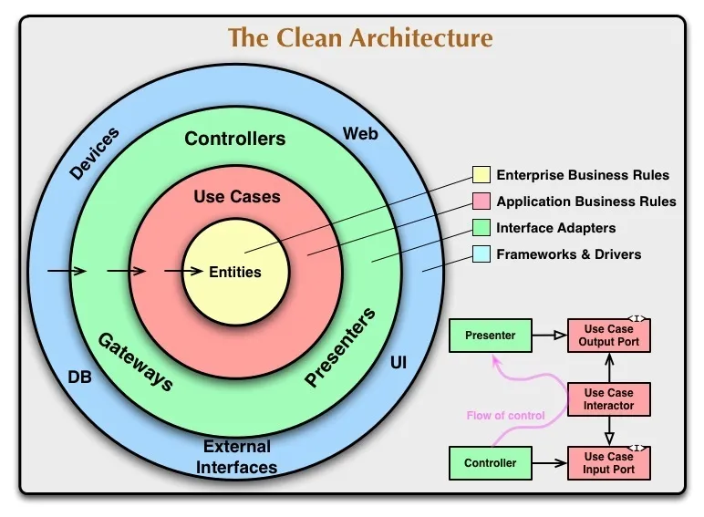

# Pragma Technical Test App [](https://codemagic.io/apps/637a5c08444d38c6a4423669/637a5c08444d38c6a4423668/latest_build)

[](https://www.linkedin.com/in/jorgemogotocoro/) [](https://twitter.com/MogotocoroJorge) [](mailto:jorgemogotocoro05@outlook.es)

A simple Flutter application.

To download this app, click here to see the [codemagic](https://codemagic.io/app/637a5c08444d38c6a4423669/build/637b913e444d3860da9f0187) builds. You can choose to install the apk or the ipa(ios).

> Please star ⭐ the repo if you like what you see 😉.

## 📝 Requirements

- Any Operating System (ie. MacOS X, Linux, Windows)
- Any IDE with Flutter SDK installed (ie. IntelliJ, Android Studio, VSCode etc)
- A little knowledge of Dart and Flutter
- Version summary:

    ```plain
    Flutter 3.22.1 • channel stable • https://github.com/flutter/flutter.git
    Framework • revision a14f74ff3a (hace 3 semanas) • 2024-05-22 11:08:21 -0500
    Engine • revision 55eae6864b
    Tools • Dart 3.4.1 • DevTools 2.34.3
    ```

## Project Structure

This project follows the guidelines of clean architecture.



## 💡 Features

- [x] Internationalization. Support for English and Spanish languages.
- [x] Error Handling.
- [x] Dependency injection.
- [x] Lazy image loading.
- [x] Dark theme and light theme.

## 🔌 Packages

| Name                                                                              | Usage                                               |
| --------------------------------------------------------------------------------- | --------------------------------------------------- |
| [**Another Flushbar**](https://pub.dev/packages/another_flushbar)                 | A flexible widget for user notification             |
| [**BLoC**](https://pub.dev/packages/bloc)                                         | State Management                                    |
| [**cached_network_image**](https://pub.dev/packages/cached_network_image)         | Library to load and cache network images            |
| [**Dartz**](https://pub.dev/packages/dartz)                                       | Functional Error Handling                           |
| [**Dio**](https://pub.dev/packages/dio)                                           | HTTP networking package                             |
| [**rxdart**](https://pub.dev/packages/rxdart)                                     | State Management                                    |
| [**Dartz**](https://pub.dev/packages/dartz)                                       | Functional Error Handling                           |

## 🚀 Getting Started

```bash
    flutter gen-l10n
    flutter packages pub run build_runner build --delete-conflicting-outputs
    flutter run
````

## 🧪 Testing (Linux)

```bash
    flutter packages pub run build_runner build --delete-conflicting-outputs
    flutter test
````

## 👨‍💻 Author(s)

[**Jorge A. Mogotocoro F.**](https://www.linkedin.com/in/jorgemogotocoro/)
